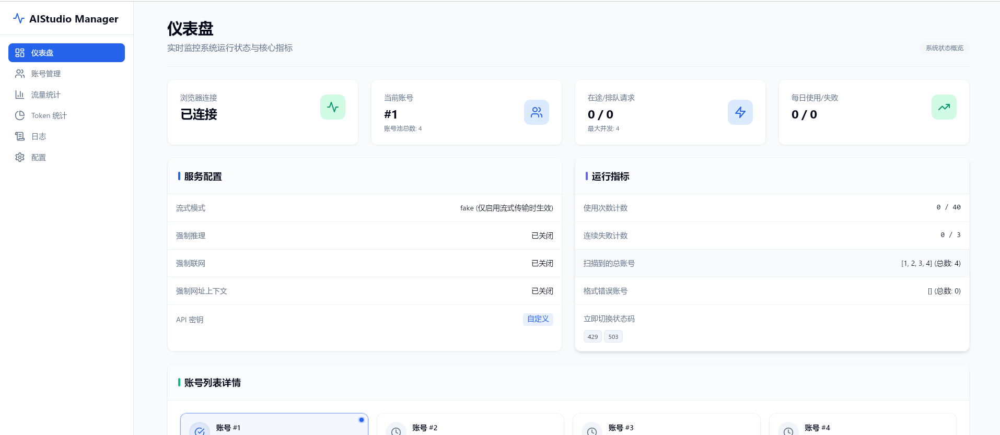
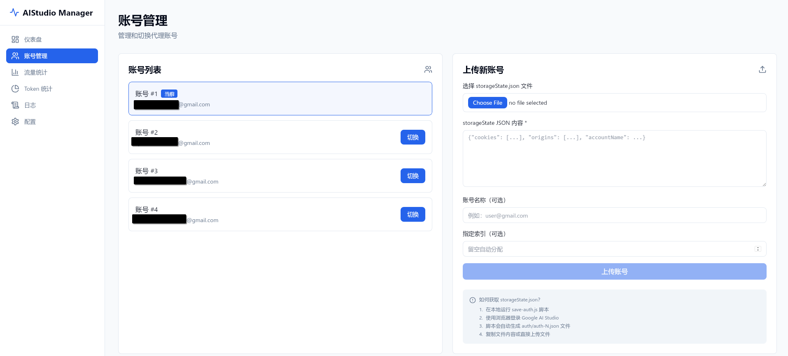
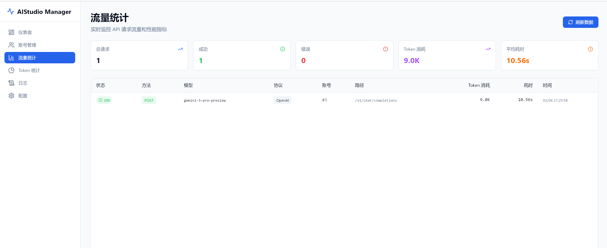
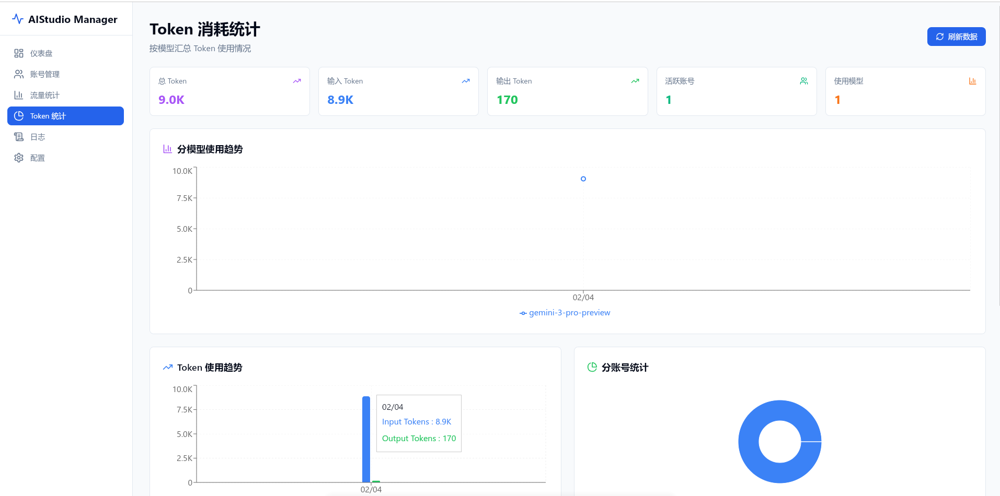
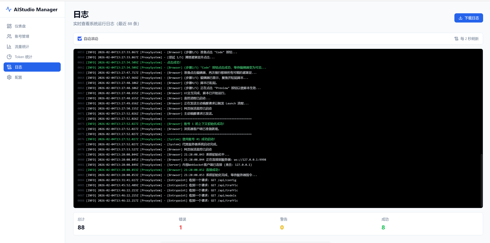
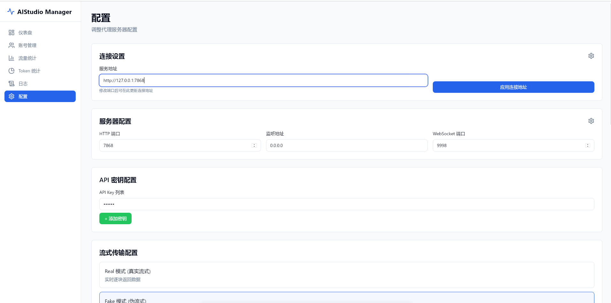

<div align="center">

# 🤖 AIStudio Manager

**Google AI Studio 账号管理与 API 代理的终极解决方案**

[](LICENSE)
[](https://nodejs.org/)
[](https://tauri.app/)
[](https://react.js.org/)

[主要功能](#-主要功能) •
[界面预览](#-界面预览) •
[快速开始](#-快速开始) •
[配置文档](#-配置说明) •
[API 参考](#-api-端点)

</div>

---

**AIStudio Manager** 是一个功能强大的中间件系统，旨在解决 Google AI Studio 在生产环境下的稳定性与管理问题。它集成了多账号轮询、自动故障转移、Token 消耗深度分析以及现代化的桌面管理界面，助你构建高可用的 AI 服务。

## ✨ 主要功能

| 功能模块 | 描述 |
| :--- | :--- |
| 🔐 **多账号池管理** | 支持导入和管理无限个 Google 账号，实现高并发下的负载均衡。 |
| 🔄 **智能故障转移** | 遇到 429/503 错误或达到使用阈值时，自动切换至健康账号。 |
| ⚡ **API 代理增强** | 完美兼容 Google Generative AI API。 |
| 📊 **全链路监控** | 实时可视化流量大屏，记录每一次 API 调用的耗时、状态与模型分布。 |
| 📉 **Token 审计** | 精确到 Input/Output 的 Token 消耗统计，生成可视化趋势报告。 |
| ⚙️ **灵活配置** | 支持 YAML 配置文件热重载与环境变量（ENV）覆盖，适应容器化部署。 |
| 🖥️ **跨平台客户端** | 基于 Tauri + React 构建的现代化桌面应用，操作丝滑。 |

---

## 📸 界面预览

以下是 AIStudio Manager 的核心界面展示：

| **仪表盘 (Dashboard)** | **账号管理 (Accounts)** |
| :---: | :---: |
|  <br> *实时系统状态与快速统计* |  <br> *账号状态监控与导入* |
| **流量统计 (Traffic)** | **Token 分析 (Token Stats)** |
|  <br> *API 调用时间线与状态码分布* |  <br> *模型 Input/Output 消耗分析* |
| **系统日志 (Logs)** | **高级配置 (Settings)** |
|  <br> *实时运行日志追踪* |  <br> *API Key 与系统参数设置* |

---

## 🚀 快速开始

### 前置要求
* **Node.js**: 16.0 或更高版本
* **pnpm**: 包管理工具
* **Rust**: 仅用于构建 Tauri 桌面端

### 安装与运行

#### 1. 克隆项目
```bash
git clone https://github.com/LemonFan-maker/AIStudio-Manager.git
cd AIStudio-Manager
pnpm install
```

**对于Windows系统**

在项目根目录新建 `camoufox`，下载 `https://github.com/daijro/camoufox/releases/download/v135.0.1-beta.24/camoufox-135.0.1-beta.24-win.x86_64.zip`，之后将其解压在新建的 `camoufox` 中。解压完毕应该可以在 `camoufox` 底下找到 `camoufox.exe` 这个程序。

**对于Linux/MacOS系统**

```bash
mkdir camoufox && cd camoufox
wget https://github.com/daijro/camoufox/releases/download/v135.0.1-beta.24/camoufox-135.0.1-beta.24-lin.x86_64.zip
unzip camoufox-135.0.1-beta.24-lin.x86_64.zip
```

解压完毕应该可以在 `camoufox` 底下找到 `camoufox` 这个程序。

#### 2. 初始化配置

复制示例配置文件：

```bash
cp .config.yml config.yml
```

#### 3. 启动后端服务

后端核心服务负责代理与调度：

```bash
node server.js
# 服务默认在 http://localhost:7860 启动
```

#### 4. 启动管理客户端

在新的终端窗口中启动桌面端：

```bash
cd tauri-app
pnpm tauri dev
```

---

## 🛠 配置说明

核心配置文件位于根目录的 `config.yml`。

### 核心参数 (`config.yml`)

```yaml
server:
  httpPort: 7860          # 核心服务端口
  wsPort: 9998            # WebSocket 通信端口

streaming:
  mode: real              # 模式: 'real' (真实流) 或 'fake' (模拟流)

accountSwitching:
  failureThreshold: 3     # 连续失败多少次后切换账号
  switchOnUses: 40        # 单个账号使用多少次后轮换
  immediateSwitchStatusCodes: [429, 503] # 触发立即切换的状态码

retry:
  maxRetries: 1           # 请求失败重试次数
  retryDelay: 2000        # 重试间隔 (ms)

concurrency:
  maxConcurrentRequests: 3 # 最大并发请求数
```

### 环境变量 (Environment Variables)

支持使用环境变量覆盖默认配置，适合 Docker 部署：

| 变量名 | 描述 | 默认值 |
| --- | --- | --- |
| `PORT` | HTTP 服务端口 | `7860` |
| `API_KEYS` | 系统访问鉴权 Key (逗号分隔) | - |
| `STREAMING_MODE` | 流式模式 (`real`/`fake`) | `real` |
| `FAILURE_THRESHOLD` | 账号故障切换阈值 | `3` |
| `SWITCH_ON_USES` | 账号轮换使用次数阈值 | `40` |

---

## 📖 使用指南

### 1. 账号录入

1. 运行项目根目录下的脚本采集账号 Cookie：
```bash
node save-auth.js
```


2. 或者在 Web 界面的 **"账号管理"** 页面，直接上传 `storageState.json` 文件。
3. 系统会自动验证有效性并存入 `auth/` 目录。

### 2. 对接 API

AIStudio Manager 提供了与 Google 官方一致的 API 路径。

**Base URL:** `http://localhost:7860`

**示例调用 (cURL):**

```bash
curl -X POST "http://localhost:7860/v1beta/models/gemini-1.5-pro:generateContent?key=YOUR_SYS_KEY" \
-H "Content-Type: application/json" \
-d '{
    "contents": [{"parts": [{"text": "Hello, world"}]}]
}'
```

---

## 📡 API 端点参考

### 🖥️ 系统与管理

* `GET /api/status` - 获取系统整体健康状态
* `GET /api/config` - 获取当前配置
* `POST /api/config` - 热更新配置
* `GET /api/models` - 获取可用模型列表

### 🔐 账号控制

* `GET /api/auth/status` - 查看所有账号的活跃状态与错误率
* `POST /api/auth/upload` - 动态上传新账号凭证
* `POST /api/auth/switch/:index` - 强制切换到指定索引的账号

### 🚦 流量与日志

* `GET /api/traffic/logs` - 获取详细的 API 请求日志
* `GET /api/traffic/summary` - 获取 Token 消耗摘要

---

## 📂 项目结构

<details>
<summary>点击展开查看完整目录结构</summary>

```
AIStudio2API/
├── auth/                  # 存放账号凭证 (自动生成)
├── tauri-app/             # 前端 Tauri + React 项目
│   ├── src/               # React 源代码
│   └── src-tauri/         # Rust 后端代码
├── config.yml             # 主配置文件
├── server.js              # 后端主入口
├── unified-server.js      # 统一服务逻辑
├── black-browser.js       # 浏览器指纹模拟模块
├── config-manager.js      # 配置管理模块
└── save-auth.js           # 账号采集脚本

```

</details>

---

## 📄 许可证

本项目采用 [MIT License](https://www.google.com/search?q=LICENSE) 许可证。

<div align="center">
Made with ❤️ by LemonFan-maker(OrionisLi)
</div>
